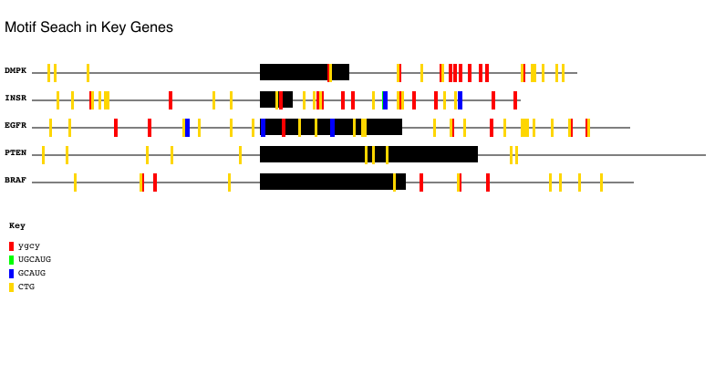

## Motif_Marker v1.2

by Adrian Bubie


**Motif Marker** is a python script used to identify short repeat/sequence motifs around intron-exon boundaries of given DNA/RNA sequences. Motifs are user defined, and translated into regular expression search terms using the IUPAC nomenclature standard. Motif locations returned by regex search are used to mark sub-sequence locations on a 1-to-1 pixel to basepair graph of the intron-exon sequence. 



Note that Motif Marker recognizes exon sequences as using capitalized characters (ATUCG) and intron sequences using lowercase (atucg), as per UCSC Genome Browser sequence download format.

Motif Marker can currently handle any number of intron-exon sequences, in FASTA format; however, note that only *one* intron-exon sequenceper FASTA sequence is graphed. If you would like to graph multiple exons in a gene, each exon must be split into its own FASTA entry (see fasta files in `/test` directory for examples).

### Downloads and Requirements

This program requires python v3.6+ and the python cario drawing package (for python3.4/3.5, please use the 3.4.py script version). 
The pycario package download can be found [here](https://pycairo.readthedocs.io/en/latest/). 

To run the script, download the `Motif_Marker.py` executable. Modify the path in the shebang (first line) to point to your python3 install directory.  From the command line, execute the program using:

```
./Motif_Marker.py -h
```

for instructions on how to run and pass in the required files.

An example execution using the optional arguments is given below:

```
./Motif_Marker.py -f test/fasta_t2.fa -m test/motifs.txt -s True -w 250 -title 'MotifSearch in Key Genes' -colors FF0000 00FF00 0000FF FFD700
```

(Current version: v1.2)
